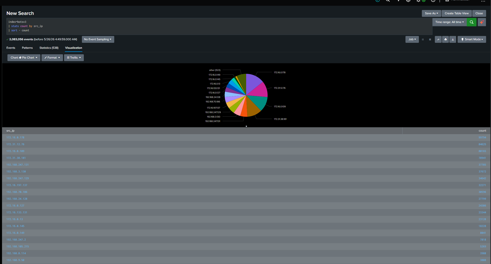
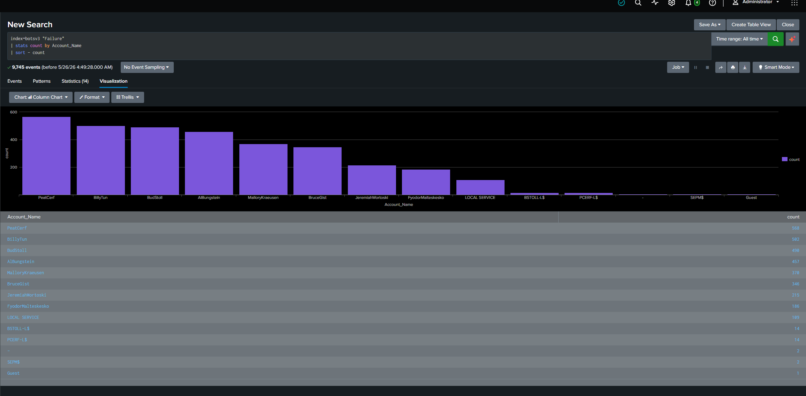
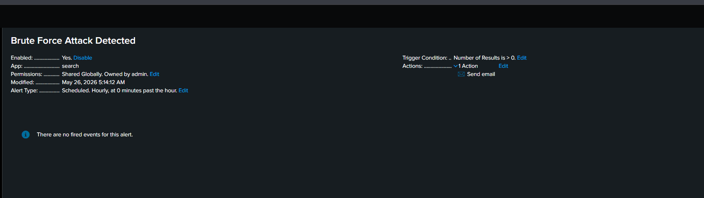

# CyberSentinel: Splunk Security Analytics

  

## 
سيناريو التحقيق الأمني (The Investigation Story)

في هذا المشروع، أتقمص دور <b>محلل أمن سيبراني (SOC Analyst)</b> يواجه سلسلة من محاولات اختراق مشبوهة. بدأت القصة بظهور ارتفاع غير مبرر في سجلات فشل تسجيل الدخول، مما دفعني لفتح تحقيق جنائي رقمي باستخدام Splunk للكشف عن هوية المهاجم وتأمين الأصول الرقمية للشركة.

---

## 
المرحلة الأولى: الاستطلاع وتحليل البيئة (Phase 1: Recon & Ingestion)

بدأتُ الرحلة بتهيئة البيئة وفهم حجم التهديد الذي أواجهه.

* **Environment Setup & Source Analysis:**  

<i>شرح: تهيئة الفهارس للتأكد من أننا نرى الصورة الكاملة للهجوم.</i>

* **Ingestion Overview:**  

<i>شرح: التأكد من تدفق البيانات لضمان عدم وجود "بقع عمياء" في رصدنا.</i>

---

## 
المرحلة الثانية: مطاردة المهاجم (Phase 2: The Hunt)

استخدمتُ لغة SPL لتحويل السجلات الصامتة إلى أدلة ملموسة.

* **Log Inspection & Auth Failures:**  

<i>شرح: تحليل سجلات 4625. اكتشفتُ نمطاً متكرراً يشير بوضوح إلى هجوم Brute-Force.</i>

* **Precision SPL Detection:** 

<i>شرح: صياغة استعلام ذكي لاكتشاف المحاولات الأكثر كثافة ومحاصرة المهاجم.</i>

---

## 
المرحلة الثالثة: التحليل الجنائي (Phase 3: Forensic Findings)

هنا بدأت أربط النقاط ببعضها وأفهم "من" و"ماذا" استهدفوا.

* **IP Activity & Attacker Identity:**   

<i>شرح: تحديد عناوين الـ IP المهاجمة ورسم خرائط زمنية لنشاطهم.</i>

* **Targeted Account Analysis:**  

<i>شرح: اكتشاف الحسابات الحساسة التي حاول المهاجم الوصول إليها وتقديم تقرير بها.</i>

---

## 
المرحلة الرابعة: الاستجابة والتحصين (Phase 4: Response & Defense)

لا يكفي الكشف، يجب أن نغلق الأبواب ونراقب في المستقبل.

* **SOC Dashboard & Alerting:**  

<i>شرح: بناء واجهة تحكم لحظية تضعني في قلب الحدث.</i>

* **Automated Alerting Workflow:**  

<i>شرح: "السيناريو الدفاعي": برمجة تنبيهات تعمل كل ساعة لرصد أي محاولة تكرار للهجوم فور وقوعها.</i>

---

## 🏁 
الخاتمة (Closing the Case)

تم إغلاق التحقيق بعد تحديد المصادر المهاجمة وتفعيل إجراءات الصد. لقد حولنا السجلات الخام إلى "معلومات استخباراتية" (Threat Intel) تحمي المنظمة.

---
