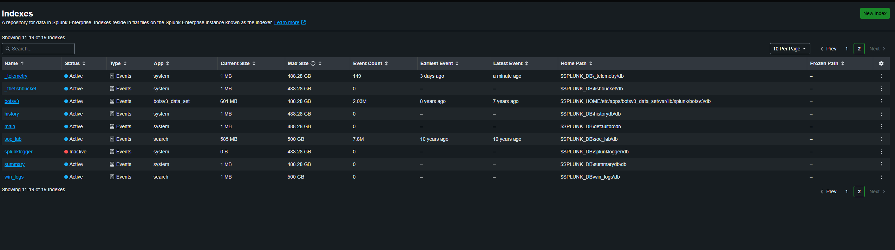
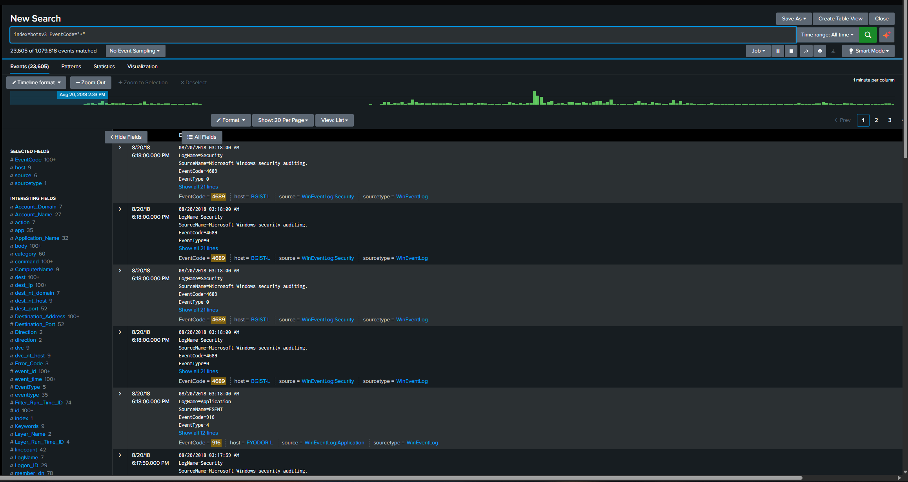
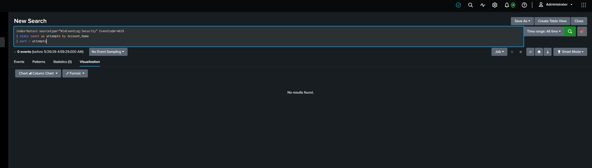
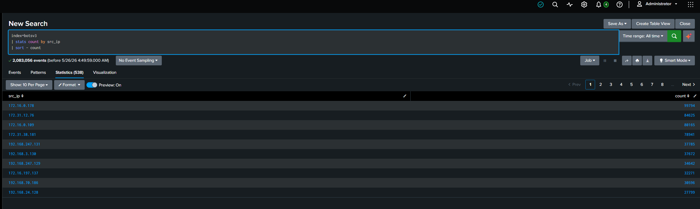
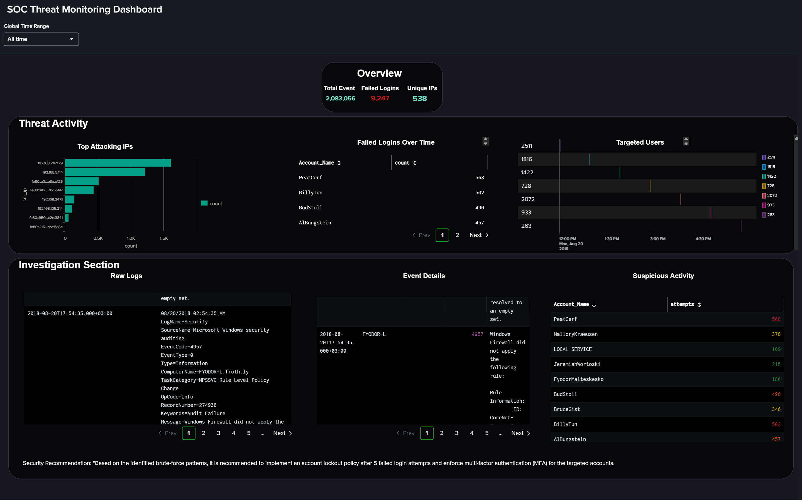
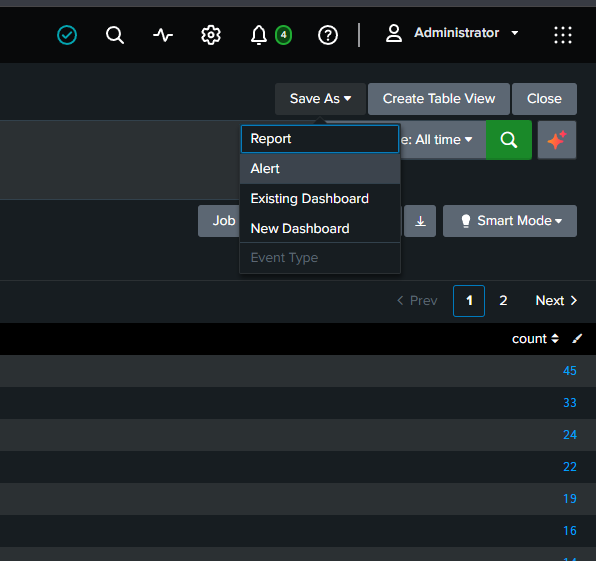
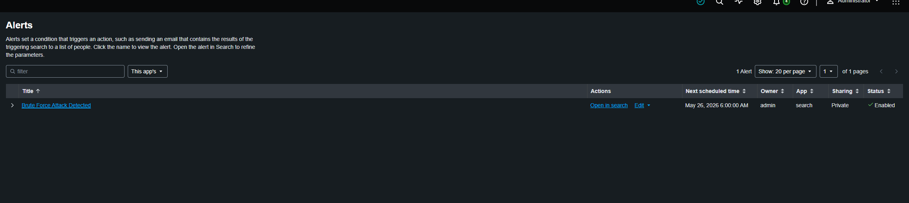

# CyberSentinel: Splunk Security Analytics


---

# CyberSentinel Architecture

```text
           +-------------------+
           |    Log Sources    |
           | Windows / Sysmon  |
           +---------+---------+
                     |
                     v
           +-------------------+
           |     Splunk SIEM   |
           | Indexing & Search |
           +---------+---------+
                     |
         +-----------+-----------+
         |                       |
         v                       v
+---------------+    +------------------+
| SPL Detection |    | SOC Dashboard    |
| Correlation   |    | Visualization    |
+-------+-------+    +--------+---------+
        |                       |
        +-----------+-----------+
                    |
                    v
          +-------------------+
          | Alerting Workflow |
          | Incident Response |
          +-------------------+
```
---

# Investigation Scenario

<div dir="rtl" align="right">
هدف المشروع هو تحويل السجلات الخام إلى <b>Actionable Threat Intelligence</b> عبر:
</div>

* **Detection Engineering**
* **Log Analysis**
* **Threat Hunting**
* **SOC Monitoring**
* **Alerting & Response**
---

# <div dir="rtl" align="right">المرحلة الأولى: Recon & Data Ingestion</div>

<div dir="rtl" align="right">

بدأتُ بتهيئة بيئة التحليل والتأكد من سلامة عملية <b>Log Ingestion</b> داخل Splunk لضمان عدم وجود أي <b>Blind Spots</b> أثناء التحقيق.

</div>

---

## Environment Setup & Source Analysis




<div dir="rtl" align="right">
<i>تحليل مصادر البيانات والتأكد من تدفق السجلات بشكل صحيح داخل الـ Indexes.</i>
</div>

---

## Ingestion Monitoring




<div dir="rtl" align="right">
<i>التحقق من استقرار تدفق البيانات ومراقبة حجم السجلات داخل البيئة الأمنية.</i>
</div>

---

# <div dir="rtl" align="right">المرحلة الثانية: Threat Hunting & SPL Detection</div>

<div dir="rtl" align="right">

تم استخدام لغة <b>SPL (Search Processing Language)</b> لتحويل السجلات إلى مؤشرات واضحة تكشف سلوك المهاجم.

</div>

---

## Log Inspection & Failed Authentication Analysis




<div dir="rtl" align="right">
<i>تحليل سجلات Windows Event ID 4625 للكشف عن محاولات تسجيل الدخول الفاشلة واكتشاف أنماط Brute Force.</i>
</div>

---

## Precision SPL Detection


<div dir="rtl" align="right">
<i>إنشاء SPL Detection Logic لتحديد أكثر عناوين IP نشاطًا وربطها بالمحاولات المشبوهة.</i>
</div>

---

# <div dir="rtl" align="right">Core SPL Detection Queries</div>

## Brute Force Detection

```spl
index=wineventlog EventCode=4625
| stats count by src_ip Account_Name
| where count > 10
| sort - count
```

---

## Top Attacking IP Addresses

```spl
index=wineventlog EventCode=4625
| top limit=10 src_ip
```

---

## Targeted Accounts Detection

```spl
index=wineventlog EventCode=4625
| stats count by Account_Name
| sort - count
```

---

## 🚨 Suspicious Login Activity Timeline

```spl
index=wineventlog EventCode=4625
| timechart count by src_ip
```

---

## High Frequency Authentication Attempts

```spl
index=wineventlog EventCode=4625
| bucket _time span=5m
| stats count by _time src_ip
| where count > 20
```

---

# <div dir="rtl" align="right">المرحلة الثالثة: Forensic Findings</div>

<div dir="rtl" align="right">

بعد تحليل السجلات، بدأتُ بربط الأحداث وتحويل البيانات إلى أدلة رقمية واضحة تساعد في فهم سلوك المهاجم.

</div>

---

## IP Activity & Attacker Tracking




<div dir="rtl" align="right">
<i>تحديد الـ IPs الأكثر نشاطًا وتحليل نمط الحركة الخاصة بالمهاجم.</i>
</div>

---

## Targeted Accounts Analysis


<div dir="rtl" align="right">
<i>تحليل الحسابات المستهدفة وتحديد الحسابات الحساسة الأكثر تعرضًا للهجوم.</i>
</div>

---

# <div dir="rtl" align="right">Detection & Use Cases</div>

| Use Case | Description |
|---|---|
| Brute Force Detection | اكتشاف محاولات تسجيل الدخول الفاشلة المتكررة |
| Suspicious Login Monitoring | مراقبة محاولات الدخول غير الطبيعية |
| Threat Hunting | البحث عن أنماط هجوم داخل السجلات |
| IOC Identification | استخراج مؤشرات الاختراق |
| Account Abuse Detection | اكتشاف استهداف الحسابات الحساسة |
| SOC Monitoring | مراقبة الأحداث الأمنية لحظيًا |
| Alert Correlation | ربط التنبيهات وتحليلها |

---

# <div dir="rtl" align="right">MITRE ATT&CK Mapping</div>

| Technique ID | Tactic | Technique |
|---|---|---|
| T1110 | Credential Access | Brute Force |
| T1078 | Defense Evasion | Valid Accounts |
| T1059 | Execution | Command & Scripting |
| T1087 | Discovery | Account Discovery |

---

#  <div dir="rtl" align="right">المرحلة الرابعة: SOC Monitoring & Incident Response</div>

<div dir="rtl" align="right">

بعد اكتشاف الهجوم، تم بناء بيئة مراقبة دفاعية تسمح بالكشف المبكر عن أي نشاط مشابه مستقبلًا.

</div>

---

## SOC Dashboard & Alert Visualization



<div dir="rtl" align="right">
<i>بناء Dashboard تفاعلي لعرض الأنشطة الأمنية والتنبيهات بشكل لحظي.</i>
</div>

---

## 🚨 Automated Alerting Workflow





<div dir="rtl" align="right">
<i>إنشاء Alerting Workflow يعمل تلقائيًا لرصد أي نشاط Brute Force وإشعار فريق الـ SOC.</i>
</div>


## 🚨 Security Alerts
للاطلاع على سير عمل التنبيهات وقواعد الاكتشاف، قم بزيارة مجلد [Alerts](alerts/).
---

# <div dir="rtl" align="right">SOC Recommendations</div>

- حظر الـ IPs المشبوهة على مستوى الـ Firewall
- تفعيل سياسات Account Lockout
- مراقبة محاولات Authentication الفاشلة بشكل مستمر
- تفعيل Multi-Factor Authentication (MFA)
- إنشاء Correlation Rules داخل Splunk
- تحسين Log Retention وVisibility

---

# <div dir="rtl" align="right">Closing the Case</div>

<div dir="rtl" align="right">

تمكنت من:
- اكتشاف هجوم Brute Force
- تحديد الـ IPs المهاجمة
- تحليل الحسابات المستهدفة
- بناء Detection Logic داخل Splunk
- إنشاء SOC Dashboard للمراقبة اللحظية
- تفعيل Automated Alerts لتحسين سرعة الاستجابة

هذا المشروع يمثل محاكاة عملية لدور <b>Junior SOC Analyst</b> داخل بيئة SIEM حقيقية.

</div>

---

# 📂 Repository Structure

* **[alerts/](alerts/)** : <span dir="rtl">منهجية التنبيه (Alerting Workflow) وقواعد الاكتشاف.</span>
* **[dashboards/](dashboards/)** : <span dir="rtl">واجهات المراقبة المرئية (Dashboards).</span>
* **[SPL-Queries/](SPL-Queries/)** : <span dir="rtl">الاستعلامات المستخدمة في تحليل Splunk.</span>
* **[screenshots/](screenshots/)** : <span dir="rtl">لقطات شاشة توثق خطوات العمل.</span>
* **[README.md](README.md)** : <span dir="rtl">التقرير التحليلي الشامل للمشروع.</span>
---

# SOC Analyst Path

<div dir="rtl" align="right">

هذا المشروع جزء من رحلتي في:

</div>
- SOC Analysis
- Threat Hunting
- Detection Engineering
- SIEM Monitoring
- Incident Response
