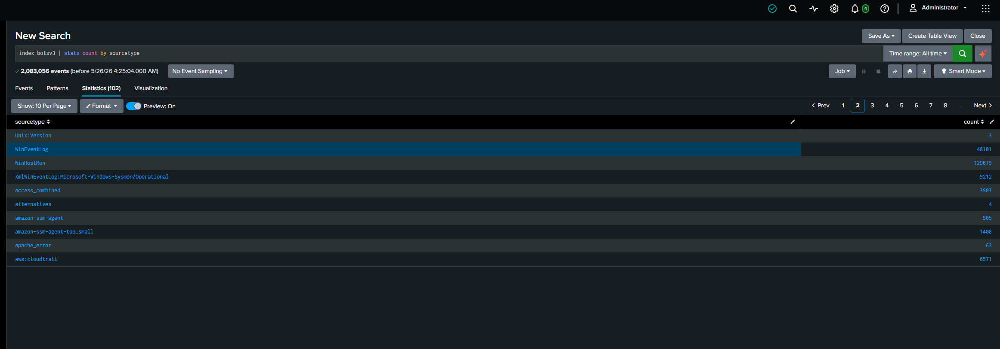
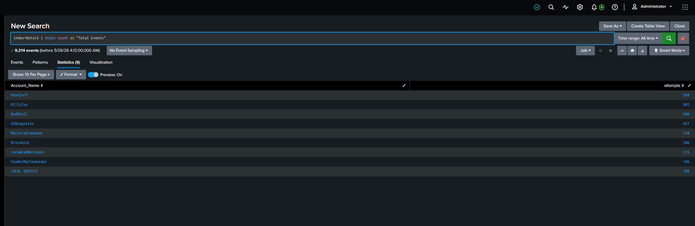
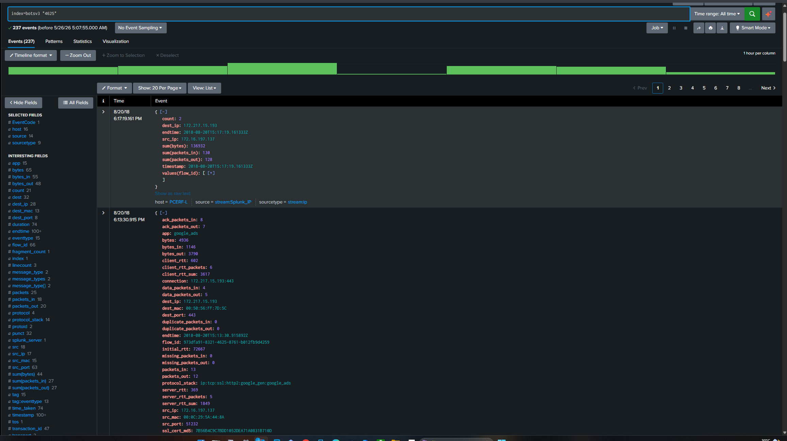
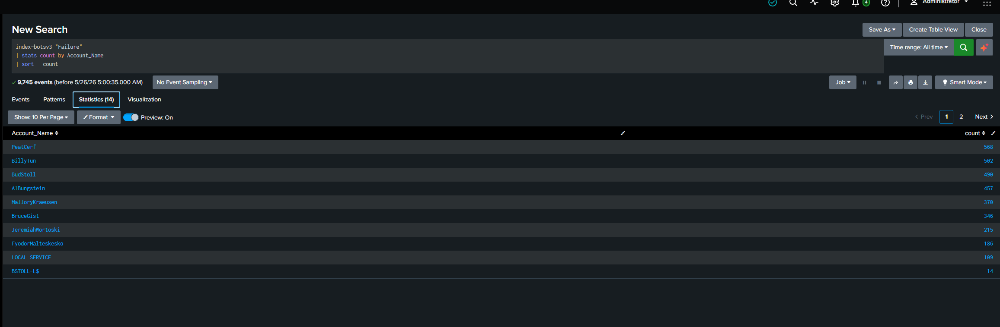
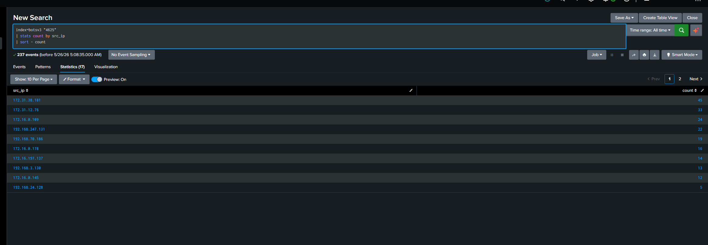
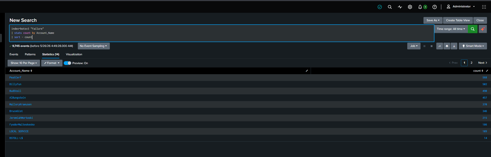

# CyberSentinel: Splunk Security Analytics

  

## 🔍 نبذة عن المشروع
هذا المشروع ليس مجرد توثيق لخطوات تقنية، بل هو محاكاة لعملية رصد وتحليل تهديدات أمنية رقمية. قمتُ باستخدام **Splunk** لتحليل سجلات ويندوز ضمن مجموعة بيانات **BOTSv3**، بهدف اكتشاف هجمات القوة الغاشمة (Brute-Force Attacks)، وتطوير نظام إنذار مبكر يحمي الأصول الرقمية.

---

## ⚙️ تفاصيل بيئة العمل
* **الأداة الأساسية:** Splunk Enterprise.
* **مجموعة البيانات:** BOTSv3 Dataset.
* **الهدف الأمني:** رصد الأحداث الأمنية ذات الرمز `4625` (فشل تسجيل الدخول) وتتبع مصادر الهجوم.

---

## 🛠 التسلسل الزمني والتحليل الفني (Investigation Steps)

### 1️⃣ إعداد البيئة وتدفق البيانات (Environment Setup)
بدأتُ العمل بتهيئة الفهارس (Indexes) واستيعاب البيانات (Data Ingestion) لضمان دقة النتائج، وفهم حجم حركة المرور داخل الشبكة.
* **Environment Setup & Index Configuration:** 
* **Data Source Analysis & Overview:** 
* **Initial Data Ingestion & Event Count:** 

### 2️⃣ التحقيق في هجمات القوة الغاشمة (Brute-Force Investigation)
باستخدام لغة استعلامات Splunk (SPL)، قمتُ باستخراج الأنماط المشبوهة وتحديد المتغيرات الأساسية.
* **Raw Log Data Inspection:** 
*شرح: فحص السجلات الخام لتحديد اسم المستخدم وعنوان الـ IP المصدر للهجوم.*
* **Precision SPL for Brute-Force Detection:** 
*شرح: قمت بصياغة استعلام SPL دقيق لحصر محاولات الدخول الفاشلة وتصنيفها حسب التكرار.*

### 3️⃣ النتائج الجنائية وتحليل المهاجمين (Forensic Results)
بعد التحليل، تم تحديد مصادر الهجوم الأكثر خطورة والحسابات التي كانت عرضة للاختراق.
* **Top Attacking Source IPs Analysis:** 
*شرح: استخرجتُ عناوين الـ IP الأكثر نشاطاً، مما مكنني من ربط المصادر المشبوهة ببداية سلسلة الهجوم.*
* **Targeted Account Analysis:** 
*شرح: حصر الحسابات الأكثر استهدافاً لتقييم مدى الضرر وتقديم توصيات أمنية بحمايتها.*

---

## الرصد والإنذار (Dashboard & Alerting)

###  بناء الداشبورد الأمنية (SOC Dashboard)
صممتُ واجهة رصد مركزية توفر رؤية شاملة لحظية للتهديدات، مما يسهل على المحللين مراقبة الشبكة.
* **SOC Threat Monitoring Dashboard:** 

### 🔔 أتمتة التنبيهات (Automated Alerting)
* **Alert Creation Workflow:** 
*شرح: لقد قمت ببرمجة التنبيه ليعمل بشكل دوري كل ساعة لرصد أي نشاط غير طبيعي وتنبيه الفريق الأمني فوراً كما يظهر في اللقطة أعلاه.*
* **Active Alert Management:** 
*شرح: قمتُ بإدارة حالة التنبيهات النشطة للتأكد من فاعلية قواعد الرصد وسرعة الاستجابة.*

---

## الخاتمة
نجح هذا المشروع في تحويل السجلات الخام إلى معلومات استخباراتية قابلة للتنفيذ. لقد كان تحدياً تقنياً ممتعاً في ربط الاستعلامات بنتائج أمنية ملموسة.

---
